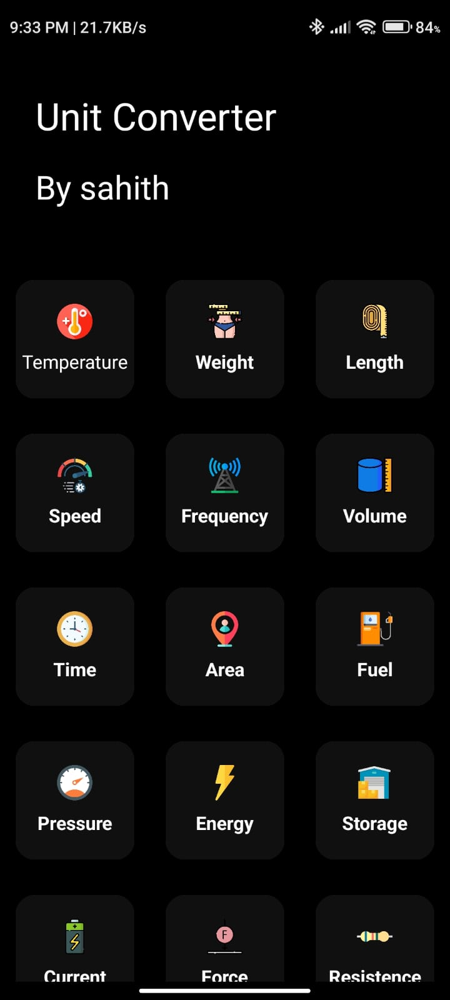
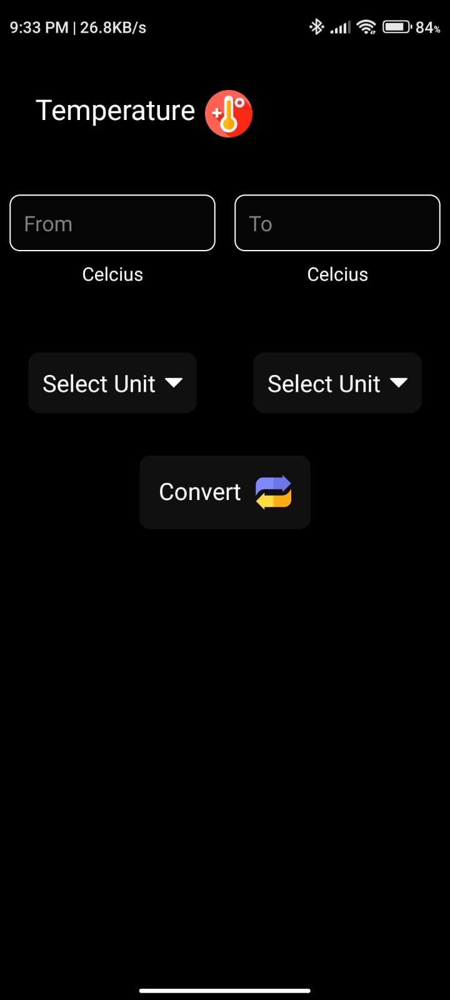

# UnitConverter - Android Unit Converter

## Description

UnitConverter is a versatile Android mobile app that serves as a unit converter for various categories, including temperature, weight, length, speed, frequency, and more. It provides a user-friendly interface and supports a wide range of units for conversion.

## Features

- Easy-to-use interface
- Supports conversion across multiple unit categories
- Provides real-time results as you type

## Screenshots

## Demo Video

## Installation

## Usage

1. Install the app on your Android device.
2. Open the app and select the desired unit category.
3. Choose the units you want to convert from and to.
4. Enter the value you want to convert.
5. View the converted result.

